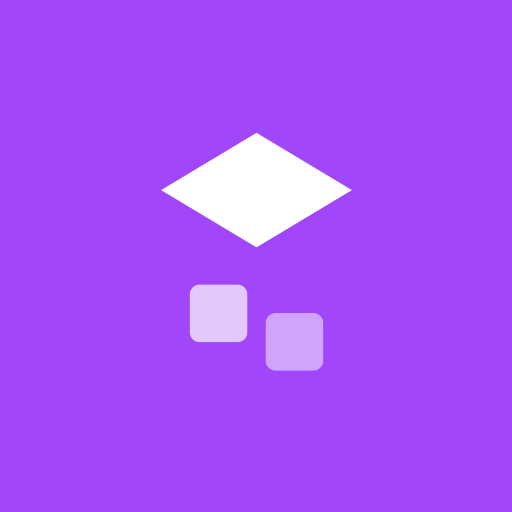

# Edge Roll

A minimalist one-thumb arcade game: swipe to tumble a cube across a bridge of
floating tiles — before they crumble away beneath you.

[](https://f-droid.org/packages/edge.roll/)

Latest APK: [GitHub releases](https://github.com/Eve-146T/edge-roll/releases/latest).

## Gameplay

- Swipe to roll the cube end over end; tap to roll straight ahead.
- Every tile you leave crumbles and drops into the abyss a moment later — and
  the grace period shrinks as your score climbs, so keep moving.
- The bridge wanders, branches, and is dotted with gem spurs (+3) and gaps that
  end the run.
- Score one point per new tile reached. Your best score is saved locally.

No accounts, no ads, no tracking, no network access.

## Screenshots

[](fastlane/metadata/android/en-US/images/phoneScreenshots/1.png?raw=true)
[](fastlane/metadata/android/en-US/images/phoneScreenshots/2.png?raw=true)
[](fastlane/metadata/android/en-US/images/phoneScreenshots/3.png?raw=true)
[](fastlane/metadata/android/en-US/images/phoneScreenshots/4.png?raw=true)

## Building

Requires a JDK (17+) and the Android SDK (platform 35, build-tools 35.0.0).

```bash
export ANDROID_HOME=/path/to/android-sdk
./gradlew assembleDebug
# -> app/build/outputs/apk/debug/app-debug.apk
```

A signed release APK is produced by CI on every `v*` tag and attached to a
GitHub release; see [`.github/workflows/build.yml`](.github/workflows/build.yml).
The libGDX native libraries are extracted from the `gdx-platform` artifacts at
build time, so they are not checked in.

## License

Edge Roll is free software, licensed under the
[GNU General Public License v3.0](LICENSE). Built with [libGDX](https://libgdx.com/).
